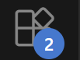
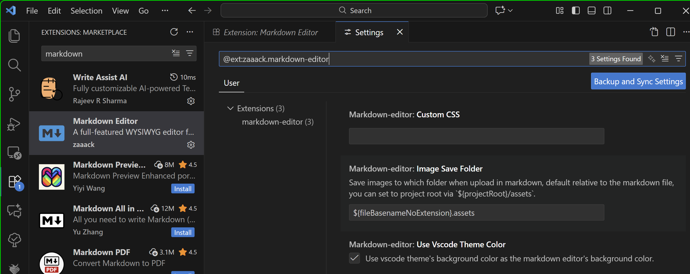

# Codetricks

These little light tutorials are ment to show important tricks with programming and tools to be efficient in physics. But it also introduces you important skills that are relevant in the current job marked.

## Things to do First

If you have not already done so, download the zip file and unpack it: [codetrick.zip](codetricks.zip)

For all tricks we see here, we need an editor. Install vscode from:
[https://code.visualstudio.com/](https://code.visualstudio.com/)

It works on Linux, Windows and Mac.

We need the Codetour extension. You can install it by opening the extension menue that resembles 4 boxes with one box rotated.



There search for ```codetour``` and install it. In order to take advantage of this extension you need to open the *.md files with vs-code! This is ideally done, if you open the folder with vs-code by using file/open folder.

## Then

Now we can use The [Codetour](https://marketplace.visualstudio.com/items?itemName=vsls-contrib.codetour) feature to automatically install and give tours that are inserted into the tutorials such that you need to type less. They also detect on which operating system you are. So now you just need to click on  link to automatically install it...

This file is actually Markdown. You might know it from the web.
The first thing we do is, we use the codetour extension to install a good markdown extension that allows us to use life editing of math formulas ($\gamma=\frac{1}{\sqrt{1-v^2/c^2}}$) and linking files and pictures. This is very important if you work in physics labs in research. Unfortunately links are currently broken in that viewer. So you need to CTRL/(OPTION on mac) click the links in the source file.

Just click on this link here to install [Markdown extension](https://marketplace.visualstudio.com/items?itemName=zaaack.markdown-editor).

Now you can just press CTRL+SHIFT+ALT+M (on Mac: OPTION corresponds to ALT and COMMAND is the CTRL key) to see this document in a WYSIWYG (what you see is what you get) view.

You can also paste images directly into that view. But before you should change the setting of that extension as following:




Such that all images are stored relative to your markdown source file in a folder called ``filename.assets``.

## Markdown cheat sheets

If you want to create markdown files yourself here is a cheat sheet. We use markdown all the time in the lab for our electronic labbooks.
[https://github.com/lifeparticle/Markdown-Cheatsheet](https://github.com/lifeparticle/Markdown-Cheatsheet)
