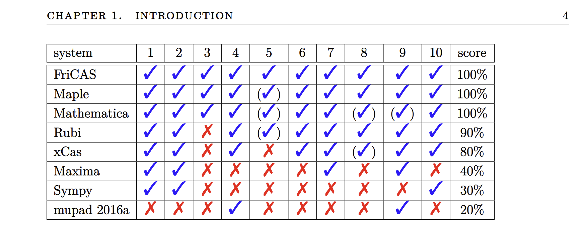
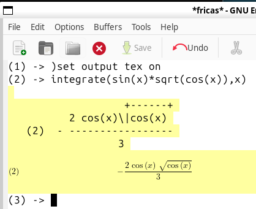

# Computeralgebra

Computeralgebra is the use of computer programs to perform symbolic analysis and
solving of equations and expressions.

In our moodle system we use Maxima, a powerfull opensource
Computeralgebrasystem.

In research we often resort to Mathematica which is a commercial system.
But if you own a raspberry pi, then you just need to run

```bash
sudo apt install wolfram-engine
```

We will install maxima [https://maxima.sourceforge.io/download.html](https://maxima.sourceforge.io/download.html). Again you can just click the codetour link (if you open the file in vs-code source code view)...

Then open the folder [04maxima](./03-maxima) for some example files with plotting, integrating, derivatives and performing Taylor series expansions.

# Restrictions of maxima

By now, you might have figured out, that as a Physicist you describe our world with differential equations. Oftenly, we have to solve inhomogenous differential equations, which by virtue of the Greens-function formalism can be transformed into integral equations. So in order to solve problems analytically, we have to solve integrals. Unfortunately maxima is not the best program for solving integrals:


As you can see FriCAS is the top computer algebra systems on the market. And it is also free and open source. Unfortunately without some small adjustment, you only get a text interface. So here is how you can get a comparable experience as with maxima. It works easiest in linux but on windows you can follow the steps described in [09-Jupyterlab-Programming](09-Jupyterlab-Programming.md) to install Windows-Subsystem-For-Linux (you can stop before "Install vscode ws-extension (only for windows)").

Then to install FriCAS do:

```bash
sudo apt update
sudo apt install emacs install texlive auctex dvipng
sudo su
cd /
#download from: https://github.com/fricas/fricas/releases
# eg.: fricas-1.3.12.amd64.tar.bz2
# unpack with
tar xjf fricas-1.3.12.amd64.tar.bz2
#start 
efricas
```

Then you can also get nicely rendered math formulas:



