# Setup a raspberry pi as a home server

Now we will show how you can have a low cost home server with a raspberry pi which can be as cheap as 30EUR for the older and slower variants. We will install a webserver and mathematica that you will be able to use from all over the world.

I would recommend a raspberry 5 with 4GB of RAM for about 65 EUR and use at least a 32 GB sd-card.
We use the minimal server image to get a small and fast system which you can then remotely access (with gui) without any overhead.

[https://downloads.raspberrypi.com/raspios_lite_arm64/images/](https://downloads.raspberrypi.com/raspios_lite_arm64/images/)

use this software to write the image on an sd card:

[https://win32diskimager.org/](https://win32diskimager.org/)

[https://www.win-rar.com/download.html?&L=1](https://www.win-rar.com/download.html?&L=1)

under linux or osx you can use the ``dd`` tool. But you need to figure out the device name of your sdcard.

```bash
unxz filename.xz
sudo dd bs=1M if=filename.img of=/dev/sdcarddevicename
```

We need to write an empty file on the sd card named ``ssh`` to allow ssh access.

Generate a user by generating a file named ``userconf.txt`` with the content:

```bash
username:#weFEW$W$EfE4f3f4$$fw4erfwk4fj4lkjwelkfjwlkfjlwk\
```

where you would replace username by your account's username you want to use.

The text after colon is an encrypted password which can be generated with linux, osx or wsl (for windows): ``  echo 'MYPassword' | openssl passwd -6``

Use a secure password and do not forget the space before ``echo`` to avoid storage of passwords in the command line history.

Also if you want to use it as home server you should connect it to your router with a giga bit ethernet cable.

Then log into the pi with command line and switch of wifi (only necessary if you have used the desktop image of raspberry pi)

ssh username@raspberrypi
sudo nmcli radio wifi off
the session might disconnect

but next time you connect it is going through ethernet.

Now we need to configure the router to expose ssh, https and http, remote desktop to the outside world through network address translation (NAT), which basically translates the [private ip](https://en.wikipedia.org/wiki/Private_network) of your pi to the outside world.

If you have a domain registered you can set dyndns to access your raspberry pi from the world wide web.

But if not and you have a fritz box then you can use [my fritz](https://www.tutonaut.de/anleitung-myfritz-konto-als-dyndns-ersatz-nutzen/).

I will use strato as domain registry so you can access your pi with e.g raspberrypi.mustermann.de from every where.

Lets first open ssh (port 22), http (port 80), https (port 443), remote desktop (port 3389) ports. Go to:

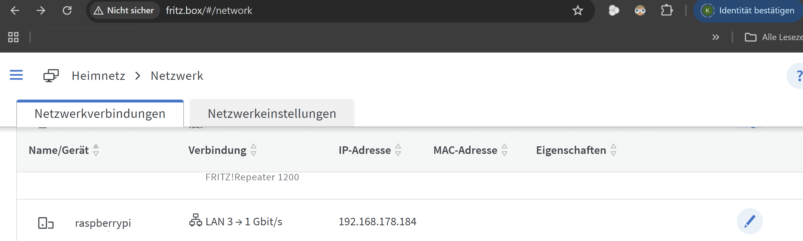

and click on the pen

and select Port freigaben:

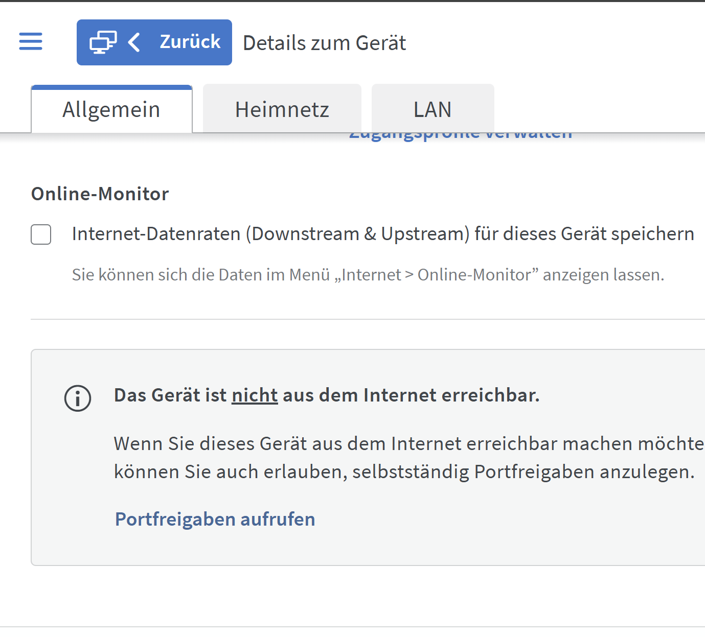

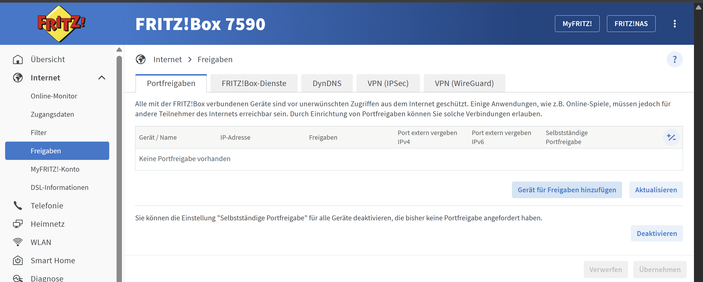

click add device for port sharing

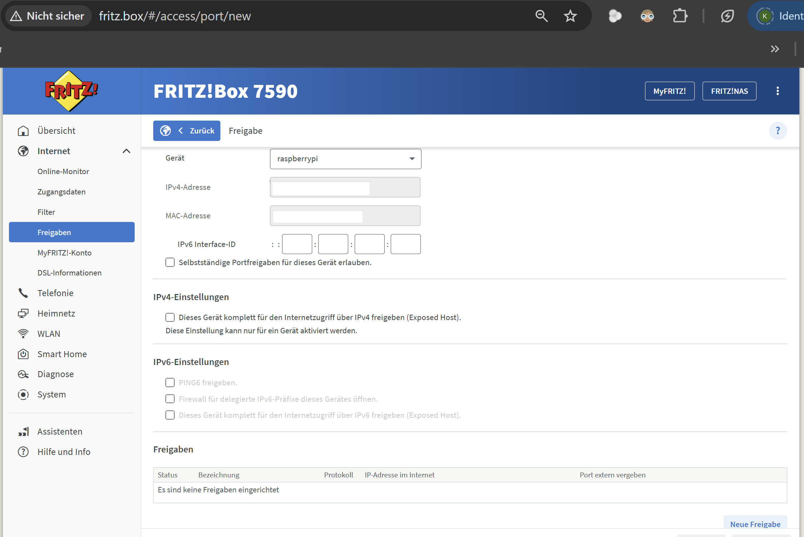

click on new port sharing and add port 80, 443(https) and 22 (ssh) and 3389 (remote desktop)

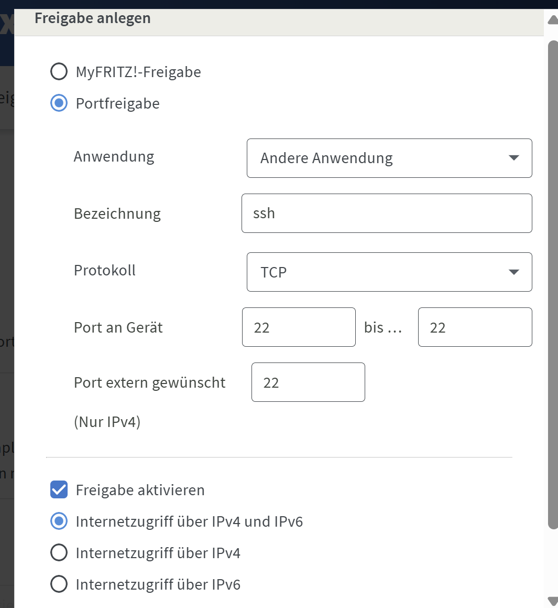

do the same for 80 and 443 and 3389 (remote desktop)

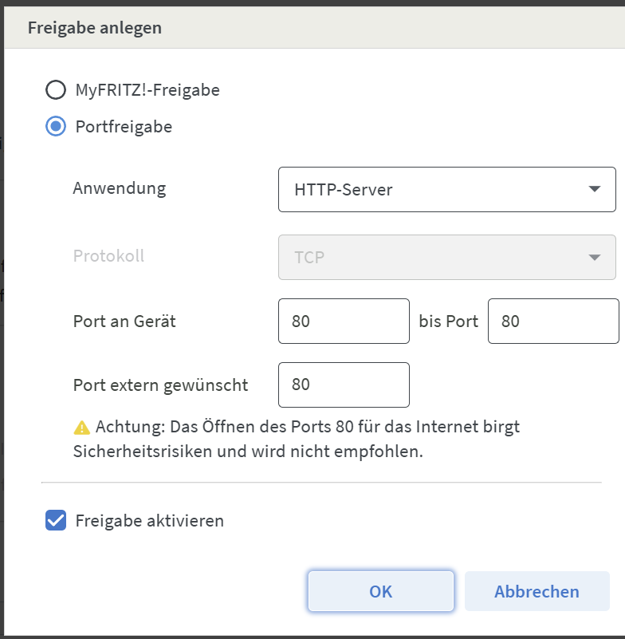

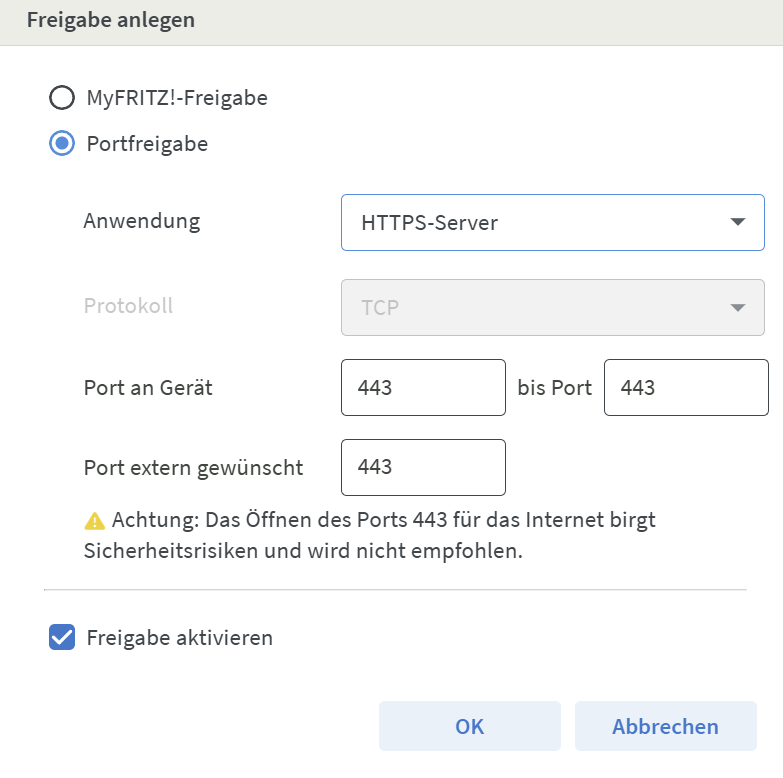


finally click the checkbox and click on accept

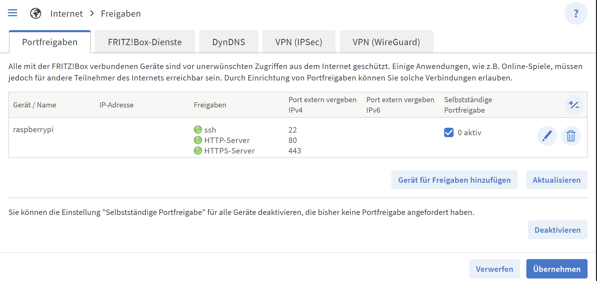

then setup your dyndns with your domain privider:

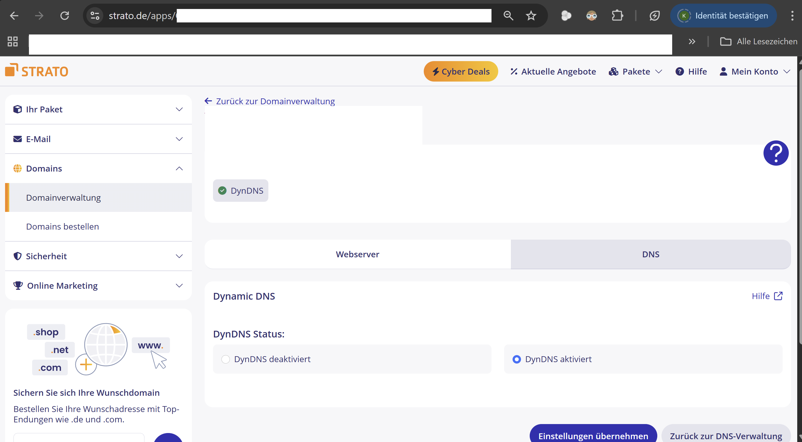

setup the settings in fritz box:

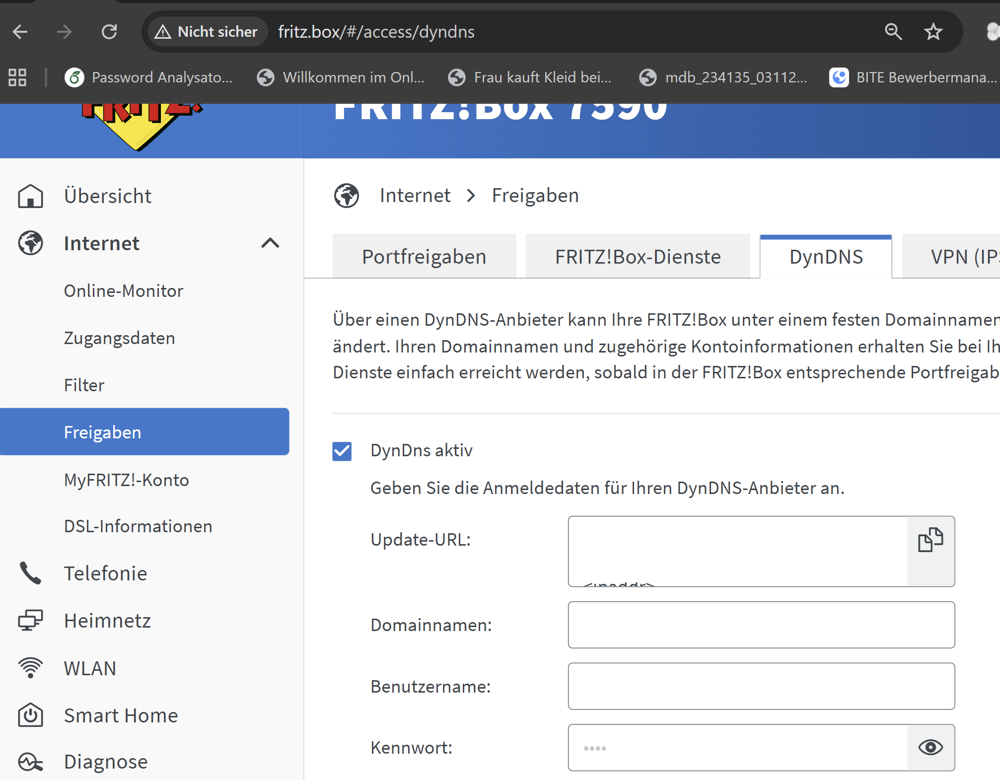

the settings vary from provider for strato see here: [https://www.strato.de/faq/hosting/so-einfach-richten-sie-dyndns-fuer-ihre-domains-ein/](https://www.strato.de/faq/hosting/so-einfach-richten-sie-dyndns-fuer-ihre-domains-ein/)

to get an apache webserver running do:

```bash
sudo apt update
sudo apt install apache2
sudo service apache2 start
sudo systemctl enable apache2

```
To check this up, open the virtual host file for your domain using `nano` or your preferred text editor:

```bash
sudo nano /etc/apache2/sites-available/000-default.conf
```
Find the existing `ServerName` and `ServerAlias` lines. They should look like this:

/etc/apache2/sites-available/000-default.conf

ServerName your_domain
ServerAlias www.your_domain
...
If you already have your `ServerName` and `ServerAlias` set up like this, you can exit your text editor and move on to the next step. If you’re using `nano`, you can exit by typing `CTRL+X`, then `Y` and `ENTER` to confirm.

If your current virtual host configuration doesn’t match the example, update it accordingly. When you’re done, save the file and quit the editor. Then, run the following command to validate your changes:

```bash
sudo apache2ctl configtest
```
You should get a `Syntax OK` as a response. If you get an error, reopen the virtual host file and check for any typos or missing characters. Once your configuration file’s syntax is correct, reload Apache so that the changes take effect:

```bash
sudo systemctl reload apache2
```
With these changes, Certbot will be able to find the correct VirtualHost block and update it.

```bash
#install certificates
sudo apt install certbot python3-certbot-apache -y
sudo certbot --apache -d myserver.de
## open firewall on pi
sudo apt install ufw
sudo ufw allow 80/tcp
sudo ufw disable
sudo ufw reset
sudo ufw allow 22/tcp
sudo ufw allow 80/tcp
sudo ufw allow 443/tcp
sudo ufw allow 3389/tcp
sudo ufw enable
#enable unattended upgrades
sudo apt-get install unattended-upgrades
sudo dpkg-reconfigure -plow unattended-upgrades
#select default gui

sudo apt install tasksel
sudo tasksel
#select xfce (or any other you prefer)
#click ok
#install xrdp for remote desktop access
sudo apt install xrdp
echo "xfce-session" | tee ~/.xsession
#ohne bildschirm muss man
sudo systemctl set-default multi-user.target

```
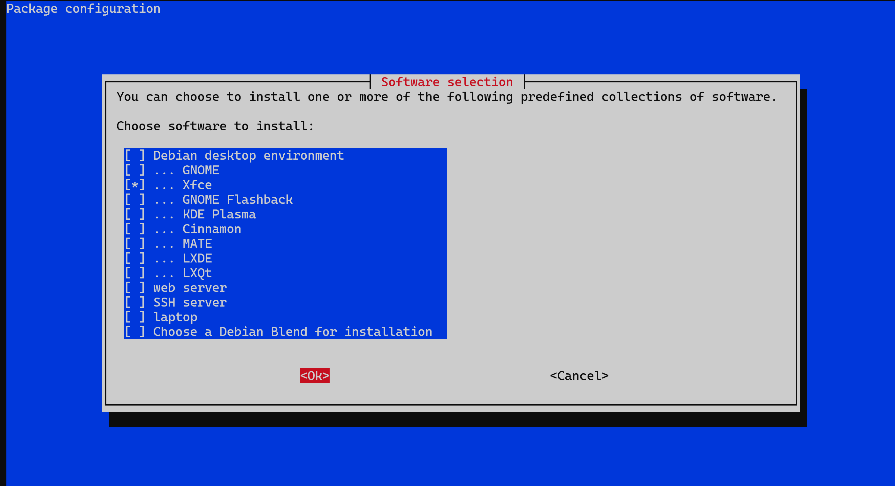

sudo apt-get install wolfram-engine

now you can connect with remote desktop

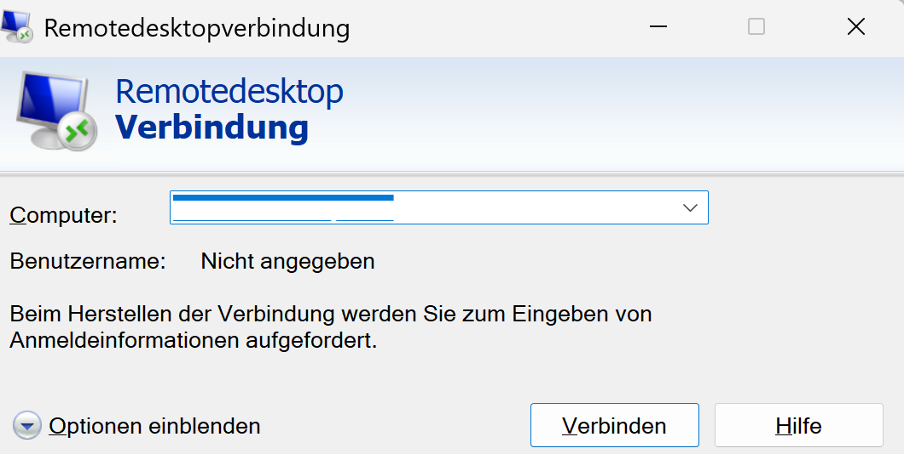


