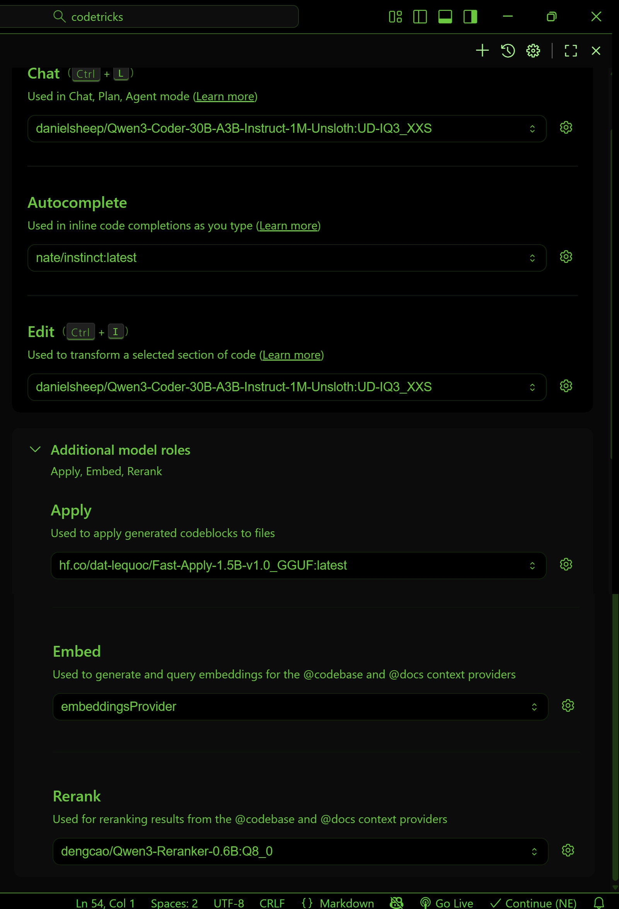

# Local AI coding

If you are using copilot and you want to try the local coding agent, then you need to first deactivate copilot in the extension manager.Local coding agent has the advantage that your source code is not transferred into the cloud.
If you work in a company they might demand this from you.

Then first install the continue.dev extension. Follow the tour...

Next we need to install a locally deployed AI model runner: Ollama
Follow the tour...

open command line and install the needed languange models:

```bash
ollama pull dengcao/Qwen3-Reranker-0.6B:Q8_0  
ollama pull danielsheep/Qwen3-Coder-30B-A3B-Instruct-1M-Unsloth:UD-IQ3_XXS 
ollama pull hf.co/dat-lequoc/Fast-Apply-1.5B-v1.0_GGUF:latest  
ollama pull nate/instinct:latest  
ollama pull nomic-embed-text:latest  
ollama pull Qwen2.5-coder:1.5b   
```

in %USERPROFILE%\.continue\config.yaml

```yaml
name: Local Config
version: 1.0.0
schema: v1
models:
  - name: Autodetect
    provider: ollama
    model: AUTODETECT

    roles:
      - chat
      - edit
      - apply
      - summarize
      - autocomplete
      - rerank
  - name: embeddingsProvider
    provider: lmstudio
    model: text-v2-moeext-embedding-nomic-embed-t
    roles:
      - embed
context:
  - provider: code
  - provider: docs
  - provider: diff
  - provider: terminal
  - provider: problems
  - provider: folder
  - provider: codebase
```

the following configurations needs to be set in continue extension by selecting ``open settings`` from the continue menue (bottom right):



Now you can use continue to tap complete your code but also to chat.
To open the chat window you can do the following press CTRL+SHIFT+P then type ``View: toggle continue``.
In chat - which you open with CTRL+L -  you can type for example type:

```
please explain me this codebase @Codebase

how does this file work @filename

```

and click on file.

you can also mark a text and press CTRL+I and say for example: ``make comments``.

Lets make a different thing how about a fibonacci [$f(0)=0, f(1)=1,f(n)=f(n-1)+f(n-2)$] number calculator.

lets make life a bit hard for ai by starting with something completely corrupted and just put your cursor where the fibonacci function is and try to press tab to get the results.

Then use the life server extension to see the result. It does not work.

Ask the ai chat to correct it itteratively.

Next we will use an ai coding agent that can even generate complete projects.