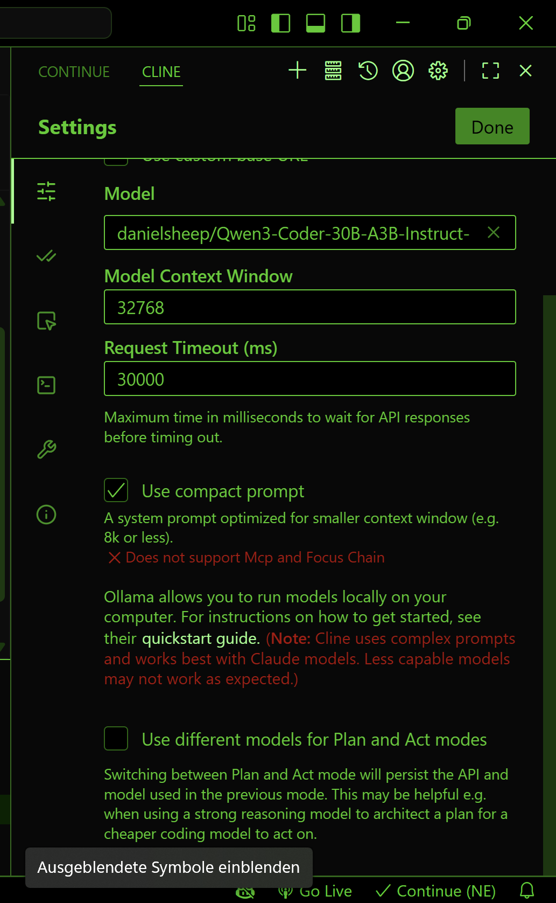

# Advanced coding agent

Now we install a coding agent that can even generate complete projects for us. In our case we will ask it to make a nice landing page with three files html, cascading style sheets and javascript. Lets see how good it will work.
This page you could then combine with the recipie content to make a real good looking web page. Wherever you want to go just tell the agent,

We are lucky as we can reuse the language models installed and just need to install the ``cline`` extension:

to make the extension visible type:
CTRL+P then type ``View: toggle Cline``

and configure the extension:



now lets ask it things such as:
```
please write a landing page with css file, js file and html file properly structured
```