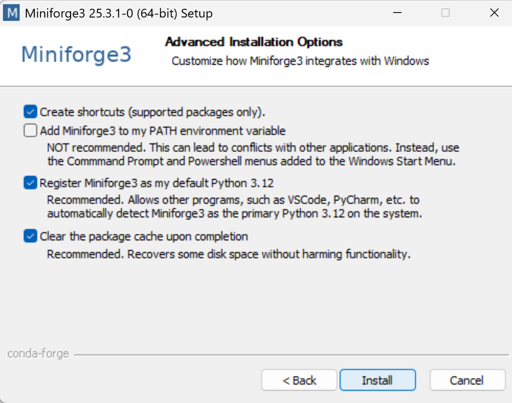

# Literature research with AI

## PaperQA
high-accuracy retrieval augmented generation (RAG) on PDFs or text files, with a focus on the scientific literature

https://github.com/Future-House/paper-qa?tab=readme-ov-file

most of the work we should have done already. We should have [ollama](https://ollama.com/download) installed.

We need a python environment we will use  [miniforge](https://conda-forge.org/download/), which allows us to install specific python versions without interfering with other python installations.

Under windows you can type

```bash
winget install --id=CondaForge.Miniforge3  -e
```

linux:

```bash
wget -O Miniforge3.sh "https://github.com/conda-forge/miniforge/releases/latest/download/Miniforge3-$(uname)-$(uname -m).sh"

```

and mac:

```bash
brew install --cask miniforge
```




then open miniforge prompt


type the following commands

```bash
mkdir pq
cd pq
conda create -n pq python=3.11 -y
conda activate pq
pip install torch
pip install git+https://github.com/huggingface/transformers
pip install git+https://github.com/huggingface/accelerate
pip install paper-qa openai
```

openai is only installed because paper-qa uses a compatible interface. we do not need openai access.

put pdf in folder

use the following python code:

filename: pq.py

generate it with ``code pq.py``

```python
import sys

from paperqa import Settings, ask
from paperqa.settings import AgentSettings

local_llm_config = {
    "model_list": [
        {
            "model_name": "ollama/mistral:instruct",
            "litellm_params": {
                "model": "ollama/mistral:instruct",
                "api_base": "http://localhost:11434",
                "api_type": "ollama",
            },
        }
    ]
}

embedding_llm_config = {
    "model_list": [
        {
            "model_name": "ollama/mxbai-embed-large",
            "litellm_params": {
                "model": "ollama/mxbai-embed-large",
                "api_base": "http://localhost:11434",
                "api_type": "ollama",
            },
        }
    ]
}

answer_response = ask(
    sys.argv[1],
    settings=Settings(
        llm="ollama/mistral:instruct",
        llm_config=local_llm_config,
        agent=AgentSettings(agent_llm="ollama/mistral:instruct", agent_llm_config=local_llm_config),
        summary_llm="ollama/mistral:instruct",
        summary_llm_config=local_llm_config,
        embedding="ollama/mxbai-embed-large",
        embedding_config=embedding_llm_config,
        paper_directory="./"
    ),
)

```

then you can ask from command line

```
python pq.py "what is paperqa?"
```

it will properly cite all resources that it used.
