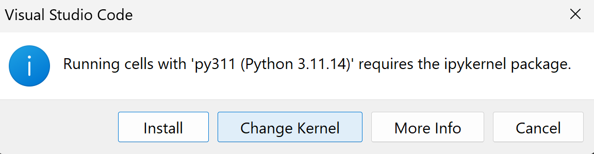

# Scientific plotting with python: jupyter notebooks

## Installation

https://www.youtube.com/watch?v=suAkMeWJ1yE

Install the [jupyter extension](https://marketplace.visualstudio.com/items?itemName=ms-toolsai.jupyter)




```json
{
    "language": "python",
    "display_name": "ROOT python",
    "argv": [
       "C:\\Users\\k\\miniforge3\\envs\\py311\\python.exe",
        "-m",
        "ipykernel_launcher",
        "-f",
        "{connection_file}"
        ],
        "env": {
            "PYTHONPATH": "c:\\root_v6.36.04\\bin"
        }
}
```

 ```bash
 jupyter kernelspec install c:\root_v6.36.04\etc\notebook\kernels\root
 ```

if you also want to run jupyter notebooks in the browser

```bash
pip install jupyter-notebook
jupyter notebook
```

