## A step-by-step guide for getting to https://localhost:3000

Here’s the scenario: You’re a developer, building a web application that will be deployed in production and served up with HTTPS. Meanwhile, as you work on your local machine, you’re testing at

```
http://localhost:3000
```

. It’s not that big of a deal, but you sure wish you could have

```
https://localhost:3000
```

.


This article will walk you through how to set that up. Step-by-step, we’ll do the following:

1. Create a certificate to make ourselves a Certificate Authority (CA) that can sign SSL certificates.

2. Sign an SSL certificate for

   ```
   localhost
   ```

   .

3. Start up a Node.js Express server that is served up using our

   ```
   localhost
   ```

   SSL certificate.

4. Configure our browser (Chrome, Firefox) and our API client (Postman, Insomnia) to allow for certificates that are signed by ourselves as the Certificate Authority.

5. Visit our local server endpoint with HTTPS, without any certificate security complaints from our browser or API client.

## Step 1: Generate a CA Certificate

The Certificate Authority (CA) is the third-party who signs SSL certificates. They’re the trusted issuers of the Internet, trusted to do their due diligence that you are who you say you are — before they’ll issue you a certificate.

Your operating system and your browser has a list of CA’s that they accept as authoritative. If you have a certificate signed by one of these CA’s, then your browser won’t complain.

*Unfortunately*, no CA is going to issue you a certificate for

```
localhost
```

. Why? Because you don’t own

```
localhost
```

. Nobody does. So, the only way to get a CA to sign that certificate is to *be* the CA that signs the certificate.


That’s our first step: generate a root CA certificate.

```
~$ mkdir cert
~$ cd cert
~/cert$ mkdir CA
~/cert$ cd CA

# Generate a private key
# Choose a simple passphrase for your key. Enter it, re-enter it.
~/cert/CA$ openssl genrsa -out CA.key -des3 2048

# Generate root CA certificate using that key (valid for 10 years)
# Enter the passphrase that you chose for the key.
# Choose defaults or enter certificate info as appropriate.
~/cert/CA$ openssl req -x509 -sha256 -new -nodes \
           -days 3650 -key CA.key -out CA.pem

~/cert/CA$ tree
.
├── CA.key
└── CA.pem
```

## Step 2: Generate Certificate, Signed By Our CA

With CA key and certificate in hand, we can sign SSL certificates as that CA. We’ll need to generate a key and a certificate signing request. Create a new folder, and open a new file in that folder called

```
localhost.ext
```

:


```
~/cert$ mkdir localhost
~/cert$ cd localhost
~/cert/localhost$ touch localhost.ext
```

This

```
localhost.ext
```

file will contain information that will be written into the signed SSL certificate.


```
authorityKeyIdentifier = keyid,issuer
basicConstraints = CA:FALSE
keyUsage = digitalSignature, nonRepudiation, keyEncipherment, dataEncipherment
subjectAltName = @alt_names

[alt_names]
DNS.1 = localhost
IP.1 = 127.0.0.1
```

We’ll be creating a certificate that works for both

```
localhost
```

and

```
127.0.0.1
```

. You can add more domains (for example:

```
DNS.2 = mysite.local
```

) or IP addresses (for example:

```
IP.2 = 192.168.100.2
```

). If you do add more domain names, though, be sure to edit your

```
/etc/hosts
```

file to have those domains point to your local machine (

```
127.0.0.1
```

).


With our certificate settings in place, we generate a key, and then use the key to generate a certificate signing request (CSR):

```
# Generate a private key
# Choose a simple passphrase for your key. Enter it, re-enter it.
~/cert/localhost$ openssl genrsa -out localhost.key -des3 2048

# Generate certificate signing request using key.
# Enter the passphrase that you chose for the key.
# Choose defaults or enter information as appropriate.
# Don't worry about entering anything for "challenge password"
~/cert/localhost$ openssl req -new -key localhost.key \
                  -out localhost.csr
```

Now, with this certificate signing request, we “ask” the CA to sign a certificate for us:

```
# Use the passphrase that you chose for the CA KEY in Step 1.
~/cert/localhost$ openssl x509 -req -in localhost.csr \
                  -CA ../CA/CA.pem -CAkey ../CA/CA.key \
                  -CAcreateserial -days 3650 -sha256 \
                  -extfile localhost.ext -out localhost.crt
```

This command takes in the certificate signing request (

```
localhost.csr
```

), the CA certificate and key (

```
CA.pem
```

and

```
CA.key
```

), and your certificate extensions file (

```
localhost.ext
```

). With those inputs, it generates your

```
localhost.crt
```

certificate file, which is good for 10 years.


You *might* get a warning message that says

```
unable to write 'random state'
```

. It’s nothing to worry about. Your certificate will still have been generated. (To get rid of that warning in the future, you can reference [this post](https://stackoverflow.com/questions/94445/using-openssl-what-does-unable-to-write-random-state-mean?ref=hackernoon.com).)


Our server will need the

```
localhost.crt
```

certificate file, but it will also need the *decrypted* key. We need to decrypt

```
localhost.key
```

and store that file too:


```
# Use the passphrase chosen for the localhost key,
# which is NOT the same as the CA key.
~/cert/localhost$ openssl rsa -in localhost.key \
                  -out localhost.decrypted.key
```

## Step 3: Create an Express Server with SSL Certificate

Just to test that this works smoothly, we’re going to create a Node.js Express server that serves up “hello world” at

```
https://localhost:3000
```

.


Up in our

```
cert
```

folder, initialize a Node.js project, and add the

```
express
```

and

```
https
```

packages:


```
# Accept all yarn defaults
~/cert$ yarn init
...
~/cert$ yarn add express https
~/cert$ touch index.js
```

With all our pieces in place, this is what our

```
index.js
```

file looks like:


```
const fs = require('fs')
const key = fs.readFileSync('./localhost/localhost.decrypted.key')
const cert = fs.readFileSync('./localhost/localhost.crt')

const express = require('express')
const app = express()

app.get('/', (req, res, next) => {
  res.status(200).send('Hello world!')
})

const https = require('https')
const server = https.createServer({ key, cert }, app)

const port = 3000
server.listen(port, () => {
  console.log(`Server is listening on https://localhost:${port}`)
})
```

Spin up the server:

```
~/cert$ node index.js
Server is listening on https://localhost:3000
```

## **Step 4: Test in Browser and API Client**

Now that we’re serving up our endpoint with SSL, let’s see what happens in our browser. We’ll use Chrome:

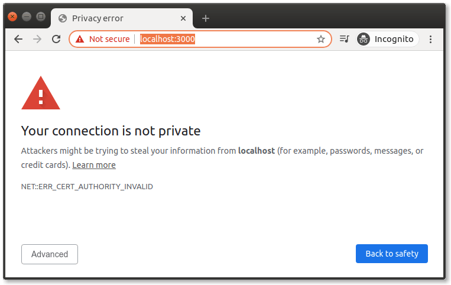

Close, but not quite. We’re serving up our endpoint with SSL, and we can even inspect the signed certificate that’s attached. The problem is that Google Chrome **does not trust the CA** that signed this certificate. And rightly so — why should Chrome (and the rest of the world) trust *us* as a CA?

We’ll deal with this. But first, let’s show what happens in Firefox:

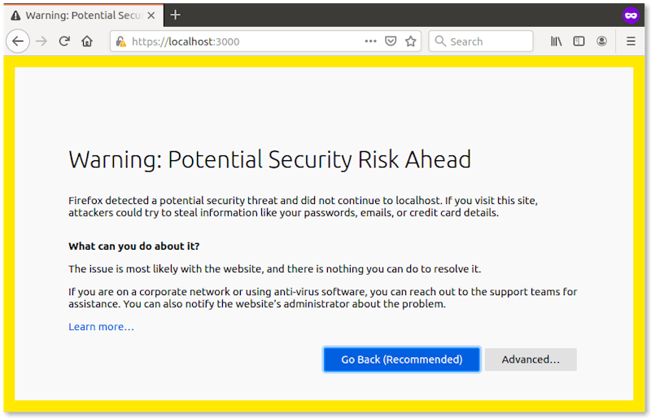

And, in Postman:

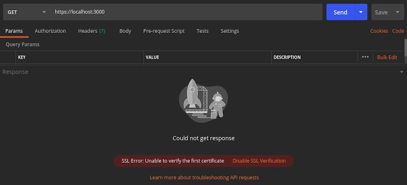

And Insomnia:

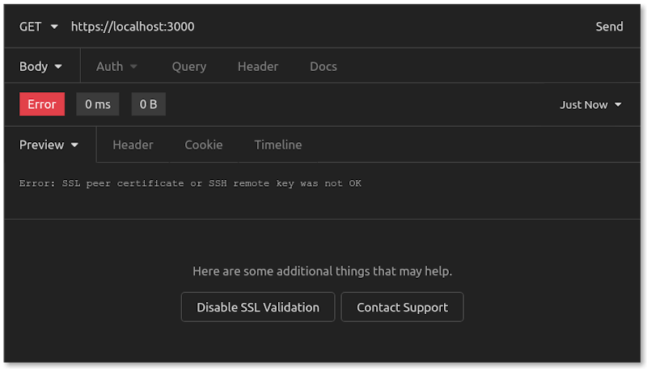

Everybody complains. But, that’s to be expected. Let’s fix this.

## Step 5: Import CA Certificate to Browsers

In each browser, we need to import our CA certificate to add ourselves as a trusted CA.

A quick note on security: *You don’t want to go and thoughtlessly add to your list of Certificate Authorities. There are certainly malicious users out there trying to pose as a CA so that they can get you to accept some website (with a certificate signed by that malicious CA) as authentic.*

add ~/cert/CA/CA.pem


manage cert in chrome from windows

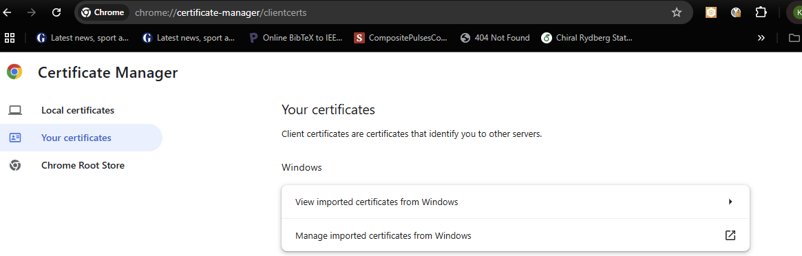

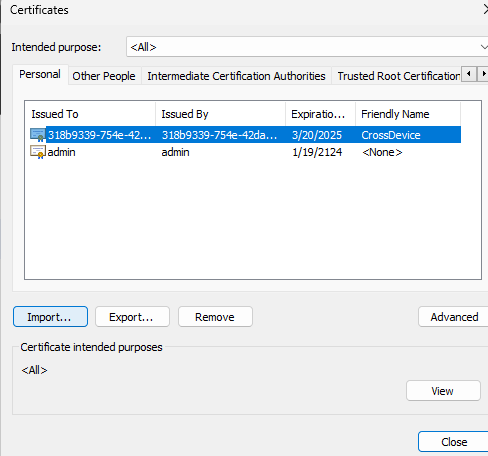

_____________________________

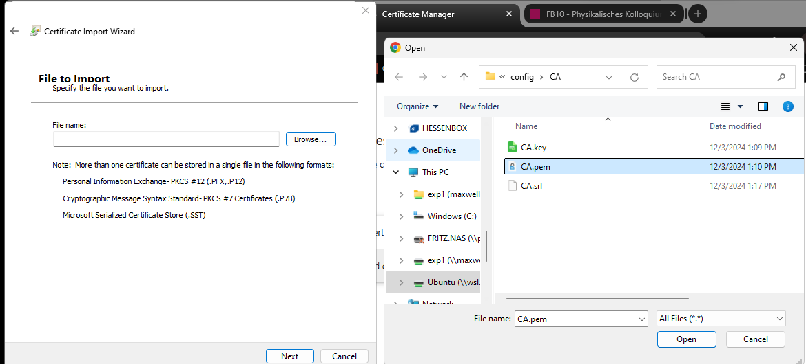

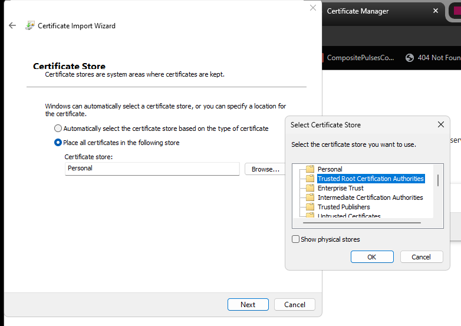

For the purposes of this exercise, since we are adding our own CA certificate as a trusted CA, this is a safe operation.

In Chrome, open the “Manage Certificates” settings under “Security.” That can be found at

```
chrome://settings/certificates
```

. Under “Authorities,” click on the “Import” button:


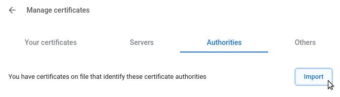

Choose your

```
~/cert/CA/CA.pem
```

file for importing. Click on the box that says “Trust this certificate for identifying websites.” Click on “OK.”


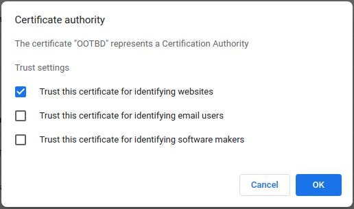

Now, with our CA trusted, let’s use Chrome to visit our endpoint again:

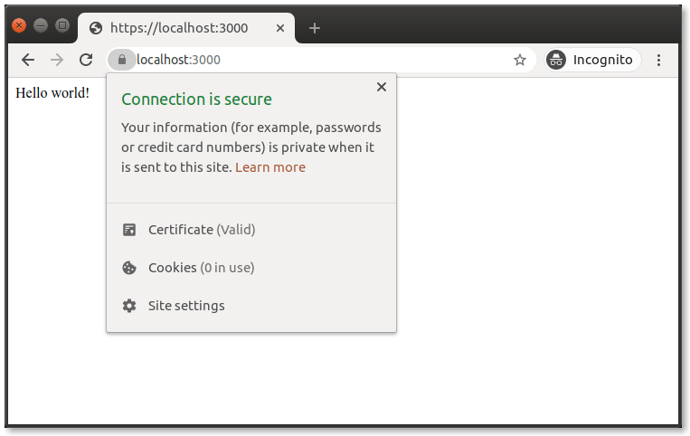

Excellent!

In Firefox, it’s a similar process. Open preferences, and navigate to “View Certificates.”

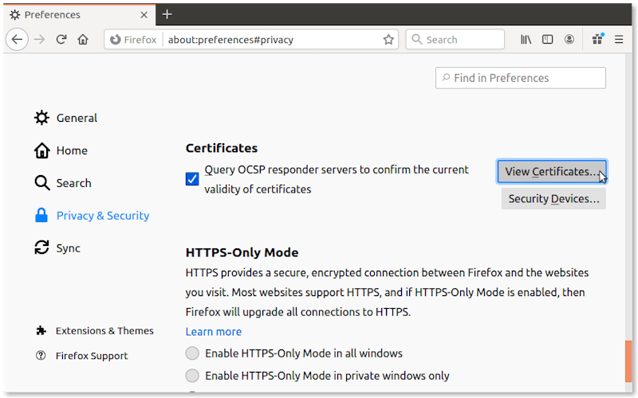

From there, go to “Authorities” and click on “Import.”

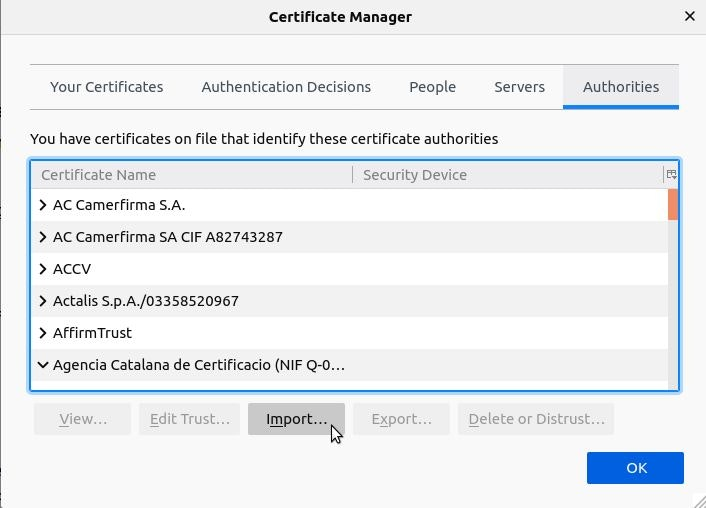

Again, choose the

```
CA.pem
```

file for importing, checking “Trust this CA to identify websites.” Click on “OK.”

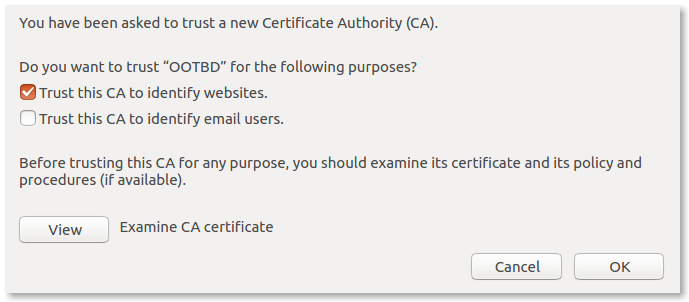

Now, we test in Firefox:

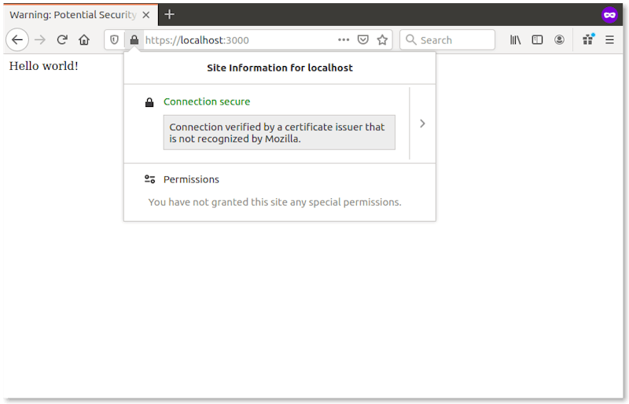

Our browsers are all set up! They trust our CA, and they trust our certificate.

## Step 6: Configure and Test API Clients

In API clients like Postman and Insomnia, the process is similar. However, you could also just **disable certificate validation**, which gets you *most* of the way there. Let’s look at our API clients one at a time.

**Getting mostly there, then all the way there, with Postman**

 In Postman, open up settings and turn “SSL certificate verification” to “OFF.” 

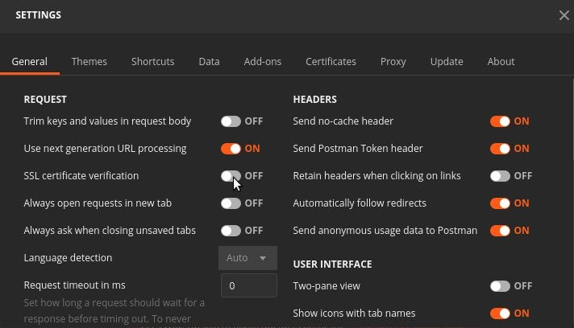

When we re-send our request in Postman, it looks like this:

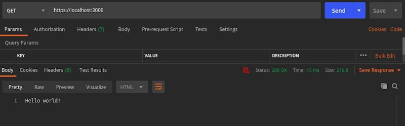

We’re able to get a

```
200 OK
```

, which is pretty good. But we do have that red security warning because we turned off SSL certificate verification. The warning looks like this:


If we want to get *all the way* to green, then we can add our CA to Postman, much like we do in our browsers. In Postman settings again, navigate to “Certificates” and then turn “CA Certificates” to “ON.” Select your

```
CA.pem
```

file as the PEM file.


Lastly, go back to “General” settings and turn “SSL certificate verification” back to “ON.”

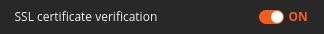

We run our request again, and this time we have a secure

```
200 OK
```

:

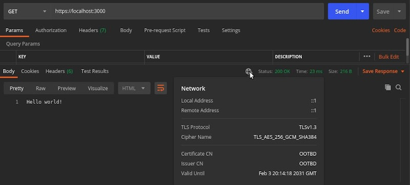

**Insomnia**

Insomnia also has the option to turn off certificate verification. In “Preferences”, navigate down the general preferences to find and **uncheck** “Validate certificates.”


When we re-run the request in Insomnia, here’s how it looks:

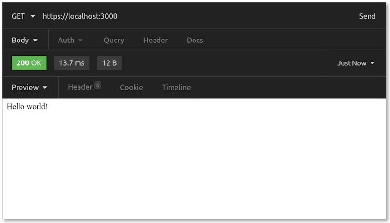

It works!

At the time of this writing, Insomnia’s desktop client for Ubuntu doesn’t yet have the ability to import your own trusted CA certificates. They’re [working on it](https://github.com/Kong/insomnia/pull/1804?ref=hackernoon.com) for Ubuntu/Mac, and they’re [making progress for Windows](https://github.com/Kong/insomnia/pull/2020?ref=hackernoon.com) too.


## Conclusion

So, **you** are probably *that* kind of developer. You know, the kind that just *has* to have

```
localhost
```

served up with SSL. Even though you know that *you’re* the CA, and you signed this SSL certificate *yourself*, and *you* tweaked your browser and API client settings to accept the certificate. But still, it just warms your heart to see a green lock in your address bar rather than a red warning.


If that’s you, consider yourself equipped.

- Photo credit (top): by [Rob King](https://unsplash.com/@zenking?utm_source=unsplash&utm_medium=referral&utm_content=creditCopyText&ref=hackernoon.com) on [Unsplash](https://unsplash.com/s/photos/lock?utm_source=unsplash&utm_medium=referral&utm_content=creditCopyText&ref=hackernoon.com)
- Photo credit (bottom): Photo by [Clint Patterson](https://unsplash.com/@cbpsc1?utm_source=unsplash&utm_medium=referral&utm_content=creditCopyText&ref=hackernoon.com) on [Unsplash](https://unsplash.com/s/photos/programmer?utm_source=unsplash&utm_medium=referral&utm_content=creditCopyText&ref=hackernoon.com)


### About Author

[](https://hackernoon.com/u/alvinslee)

**Alvin Lee**[@alvinslee](https://hackernoon.com/u/alvinslee)

Subscribe

*Full-stack. Remote-work. Based in Phoenix, AZ. Specializing in APIs, service integrations, DevOps, and prototypes.*