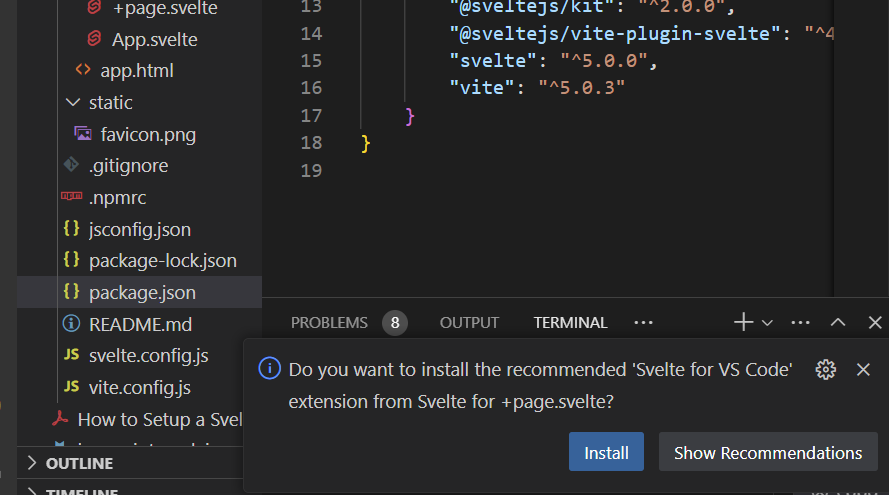
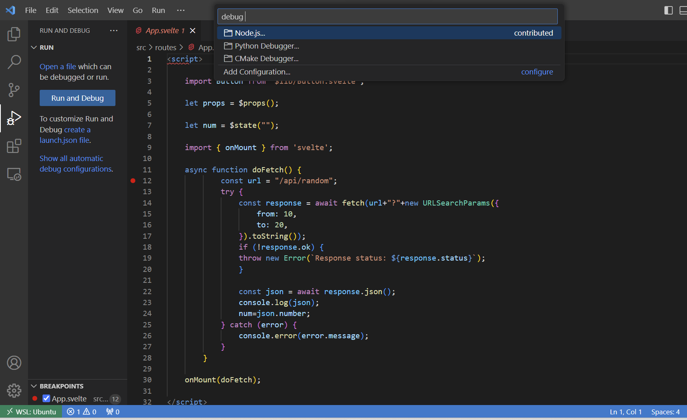
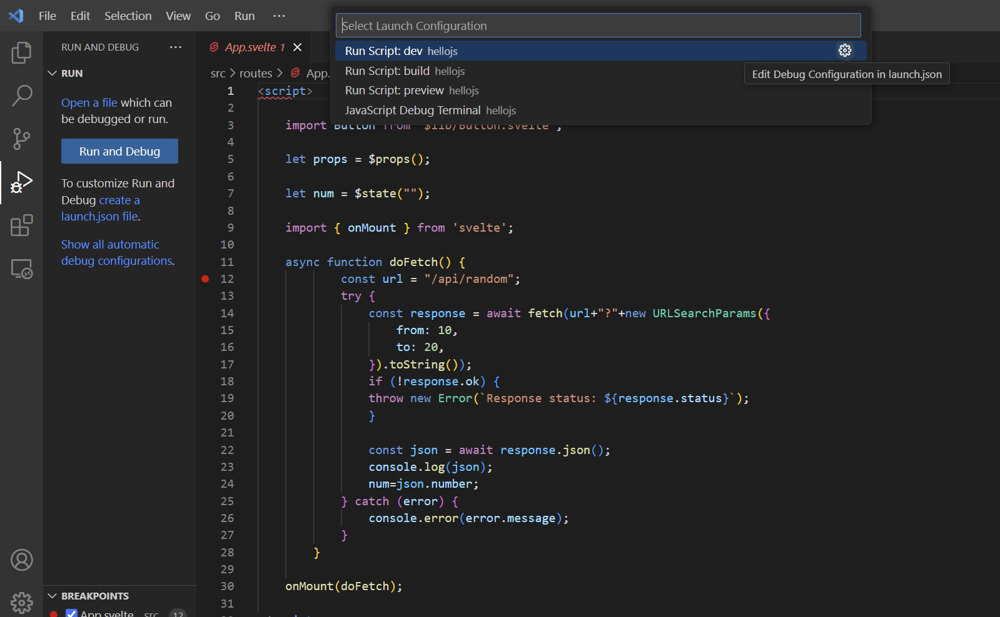

https://nodejs.org/en/download/package-manager

use the fnm example for your os (use linux if you use wsl)
exit the shell after the curl command
restart it
``sudo systemctl restart user@1000``
and then continue with ``source...``

https://svelte.dev/docs/kit/creating-a-project


after you installed fnm activate the installed version with
```bash
fnm use 22
```
then develop with
```bash
cd exp3/hellojs/hellojs
npm install
npm run dev -- --open  
```
deploy with
```bash
npm run build
```
run 
```bash
node build
```
clean up for source code packaging
```bash
rm -rf build
rm -rf node_modules
```

also open a svelte file in vs-code to do:



## Debugging

https://svelte.dev/docs/kit/debugging

https://github.com/sveltejs/kit/issues/7781#issuecomment-1634140560

select show all automatic debug confguration and select node.js






## only do the following if you want to start from zero then do

```bash
cd exp3/hellojs

npx sv create hellojs
Need to install the following packages:
sv@0.6.5
Ok to proceed? (y) y

┌  Welcome to the Svelte CLI! (v0.6.5)
│
◇  Which template would you like?
│  SvelteKit minimal
│
◇  Add type checking with Typescript?
│  No
│
◆  Project created
│
◇  What would you like to add to your project? (use arrow keys / space bar)
│  none
│
◇  Which package manager do you want to install dependencies with?
│  npm
│
◇  Installing dependencies with npm...

```

install nodejs adapter such that you can deploy for node

```
cd exp3/hellojs/hellojs
npm install -D @sveltejs/adapter-node
```

``exp3/hellojs/hellojs/svelte.config.js``

```js
//import adapter from '@sveltejs/adapter-auto';
import adapter from '@sveltejs/adapter-node';

/** @type {import('@sveltejs/kit').Config} */
const config = {
	kit: {
		// adapter-auto only supports some environments, see https://svelte.dev/docs/kit/adapter-auto for a list.
		// If your environment is not supported, or you settled on a specific environment, switch out the adapter.
		// See https://svelte.dev/docs/kit/adapters for more information about adapters.
		adapter: adapter()
	}
};

export default config;

```
``exp3/hellojs/hellojs/.vscode/launch.json``

```json
{
    // Use IntelliSense to learn about possible attributes.
    // Hover to view descriptions of existing attributes.
    // For more information, visit: https://go.microsoft.com/fwlink/?linkid=830387
    "version": "0.2.0",
    "configurations": [
        {
            "command": "npm run dev",
            "name": "Run npm dev",
            "request": "launch",
            "type": "node-terminal"
        }
        ,
		{
			"type": "chrome",
			"request": "launch",
			"name": "Launch browser",
			"url": "http://127.0.0.1:5173",
			"webRoot": "${workspaceFolder}"
		}
    ],
	"compounds": [
		{
			"name": "Both",
			"configurations": ["Run npm dev", "Launch browser"]
		}
	]
}
```


``exp3/hellojs/hellojs/src/lib/Button.svelte``

```html
<script>
	let props=$props();
</script>

	<button 
		{...props}>
		{@render props.children()}
	</button>

<style>
    
    .primary:hover{
        background-color:cornflowerblue;
    }
	.primary{
        color:white;
		background-color:blue;
	}
	.danger {
        color:white;
		background-color:red;
	}
    .danger:hover{
        background-color:orange;
    }
	.sm {
		font-size:1em;
		padding:0.1em;
	}
	.lg {
		font-size:2em
	}
</style>
```


``exp3/hellojs/hellojs/src/routes/+page.svelte``

```html
<script>
    import App from './App.svelte';
</script>
<App name="World" />
```

``exp3/hellojs/hellojs/src/routes/App.svelte``

```html
<script>
    
	import Button from '$lib/Button.svelte';

    let props = $props();
    
    let num = $state("");
    
    import { onMount } from 'svelte';

    async function doFetch() {
            const url = "/api/random";
            try {
                const response = await fetch(url+"?"+new URLSearchParams({
                    from: 10,
                    to: 20,
                }).toString());
                if (!response.ok) {
                throw new Error(`Response status: ${response.status}`);
                }

                const json = await response.json();
                console.log(json);
                num=json.number;
            } catch (error) {
                console.error(error.message);
            }
        }

	onMount(doFetch);

</script>


<Button class="primary sm" onclick={async()=>doFetch()}>
	Update
</Button>

<Button class="danger lg" onclick={()=>console.log("Clicked")}>
	Click
</Button>
<h1>Hello, {props.name} {num}!</h1>
```

``exp3/hellojs/hellojs/src/routes/api/random/+server.js``

```js
import { json } from '@sveltejs/kit';

export function GET({url}) {
	let from = Number(url.searchParams.get('from'));
	let to =Number(url.searchParams.get('to'));
	const num = Math.floor(Math.random() * (to-from) + from);
    console.log(num,from,to);
	return new Response(JSON.stringify({number:num}), {
		headers: {
			'Content-Type': 'application/json'
		}
	});
}
```

